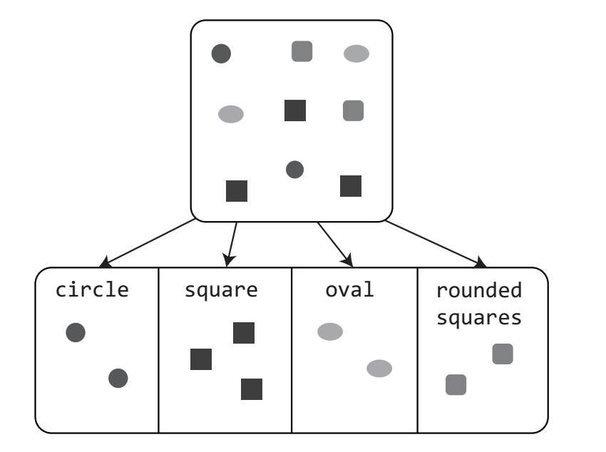
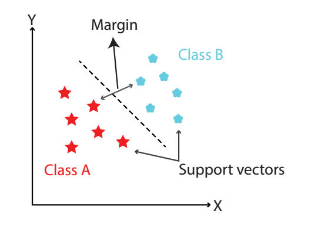
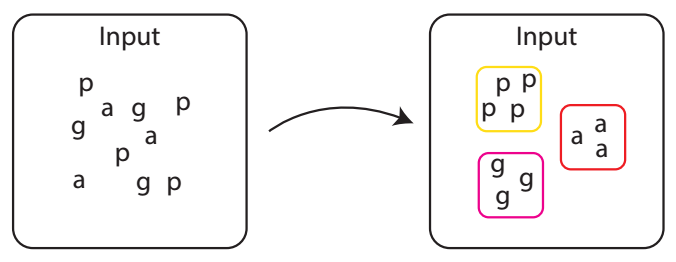
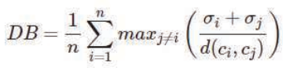
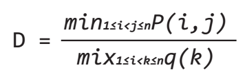

# Machine Learning

## Algorithms:

### <ins>**Supervised Learning Algorithms**</ins> :<br>
- As it’s name suggest in supervised  learning we train a machine learning  model with supervision.
- We feed the  data, train the model and tell the  model to make predictions.
- If the  predictions are correct we leave the  model to work on it’s own from there else  we help the model to predict correctly  until it learns so.
- It is the same as  teaching a child to solve questions at first  until he can solve them on his own

#### **1. Regression:**  <br>
The regression algorithm is a case of **supervised machine learning**  where we feed input data(numeric) and the algorithm  learns the patterns in the data and predicts the  output data. The performance of the algorithm is  entirely based on it’s learning so we need to do  our best to feed the best data to our model.

(a) <ins> *Simple Linear Regression* </ins> <br>
In simple linear  regression, the algorithm finds the linear  relationship between two variables <br>
i.e. if a  independent varaible is changed the dependent  variable will be affected.
Please Refer :
```bash
LinRegre_Predict_Wt.ipynb
```

(b) <ins>*Multiple Linear Regression* </ins><br>
Multiple Linear Regression or MLR is the type of  regression in which we predict a value using two  or more features like predicting the weight of a  person using the age and height values.
Please Refer :
```bash
MultiLinReg_Predict_Income.ipynb
```

#### **2. Classification:**
The classification is the type of **supervised machine learning**  in which we feed data and the model classifies the  data into different groups.



There are two types of  classification algorithms - lazy learners and eager  learners
- Lazy learners learns less during  training but more in predicting e.g. KNN  algorithms
- Eager learners learns in training  and less in testing e.g. decision tree, Naive  Bayes

(a) <ins> *Decision Tree* </ins> <br>
This algorithm can perform  both classification and regression tasks.
Please Refer :
```bash
Classifier_DeciTree_FlavourRecommender.ipynb
```

(b) <ins> *Logistic Regression* </ins> <br>
Logistic regression is a type of model that  predicts the outcome of output values as Yes or no  as numeric values 1 or 0 respectively. We can use  these type of models to classify a day as rainy or  not, a person as healthy or sick, etc. But there  are different types of logistic regression used  for to different situations.
- Binomial Logistic Regression : Binomial or binary logistic  predict exactly two outcomes  l(positive) or 0(negative)  <br>
- Multinomial Logistic Regression : In multinomial logistic regression we perform classification into 2  or more categories also the categories can be just  different types like Rain, Hailstorm, Snow, etc. or  ordinal like Heavy rain, moderate rain or low rainfall.
Please Refer :
```bash
LogiReg_rainfall.ipynb
```
(c) <ins> *Naive Bayes* </ins> <br>
Naive Bayes algorithm is based on the Bayes  theorem.
We have three types of Naive Bayes  algorithms:
• Gaussian, is used when the data in labels is  drawn from a gaussian distribution  • Multinomial, is used when the data in labels is  drawn from a multinomial distribution
• Bernoulli, is used when we have to predict  binary features like 0 or 1
Please Refer :
```bash
Naive_bayes_rainfall.ipynb
```

(d) <ins> *Support Vector Machine* </ins> <br>
- Support vector machines or SVM is case of  supervised machine learning which is used for both  regressions and classifications.
- The SVM algorithm divides a dataset into different  classes or categories in a hyperplane in  multidimensional space.
- The categories are divided  in a manner to find the maximum marginal  hyperplanes or MMH.
- These hyperplanes are  generated in an iterative manner to minimize  errors  In the above graph, the data points closest to  the hyperplane are called support vectors.
- The line separating the class A and class B is  the line called hyperplane i.e. dividing the data  into two class  And for the line called margin is the gap between  two lines on the closet data points of different  classes.
- It can be calculated as the perpendicular  distance from the line to the support vectors.
- Large margin is considered as a good margin and  small margin is considered as a bad margin.
-  The SVM algorithms find the maximum marginal  hyperplane to divide the datapoints into different classes <br>


Support vector machines are implemented with  kernels that transforms a input data space into  multidimensional for more flexiblity and smooth  workflow for the support vectors machines. <br>
There  are different types of kernels like:<br>
• Linear Kerenel, is used when predicting two  outcomes <br>
• Polynomial kernel, is more generalized version  of the linear kernel where the input space is  non-linear <br>
• Radial Basis Function kernel, is used for  SVM’s that maps the input space into infinite  dimensions <br>
Please Refer :
```bash
SVM_iris.ipynb
```
(e) <ins> *KNN* </ins> <br>
- K-Nearest Neighbours or KNN is case of  supervised machine learning which is used for both  regressions and classifications.<br>
- KNN is a lazy learning algorithm i.e. it doesn’t  have a special training phase instead it uses all  the data to for classification or creating  regression line i.e. at time of prediction.
- It is  also considered non-parametric because it doesn’t  bother about the underlying data  K in K-NN stands for nearest datapoints,

**Regression with KNN**
Please Refer :
```bash
KNN_reg.ipynb
```
**Classification with KNN**
Please Refer :
```bash
KNN_classification.ipynb
```
### <ins>**Unupervised Learning Algorithms**</ins> :
- Unlike supervised learning, we  don’t teach or check the  predictions made by the models,  instead we feed the data and ask  for predictions directly.
- And it  is obvious that much data you’ll  feed the results will be much  accurate.
- Unsupervised learning is  used in artificial intelligence  applications like face detection, object detection,  etc.

#### **1. Clustering:**  <br>
Clustering is a case of unsupervised machine  learning. The clustering algorithms learns  relations in the data and classifies it into  groups according to whether number of groups  provided with input or not


The followings are the different types of  clustering:<br><br>
• **Density-based**, clusters are formed as dense  regions. These algorithms have good accuracy  and capibility to merge two clusters together.  Like, Density-Based Spatial Clustering of  Applications with Noise (DBSCAN), Ordering  Points to identify Clustering structure (OPTICS)<br><br>
• **Heirarchial-based**, clusters are formed in a  heirarchical tree which has Agglomerative  (Bottom up approach) and Divisive (Top down  approach). Like Clustering using Representatives  (CURE), Balanced iterative Reducing Clustering  using Hierarchies (BIRCH)<br><br>
• **Partitioning**, clusters are formed by partioning  the objects into k, number of clusters will be  equal to that of partitions. Like K-Means <br><br>
• **Grid**, clusters are formed as grid. This method  is fast and independent on the number of  objects. Like Statistical Information Grid  (STING), Clustering in Quest (CLIQUE)<br><br>

<br>
We can evaluate the performance of different  clustering algorithm (not accuracy of one  algorithm) with the following metrics:<br>

1. <ins>**Silhouette Score:** </ins><br><br>
    ```bash
    Silhouette Score= p-q/max(p,q)
    ```
     <br>
    where p is the mean distance to the points in the  nearest cluster and q is the mean intra-cluster  distance to all the points<br><br>
    The silhouette score ranges from -1 to 1. <br>
    1 is the situation when the cluster is far  away from it’s neighbouring cluster<br>
    0 is the situation when the cluster is very  close or on the decision boundary itself i.e.  seperating the clusters<br>
    -1 is the situation when cluster aren’t formed  correctly<br><br>


2. <ins>**Davis-Boulden Index:**</ins><br>

<br>
where n is the number of clusters, σ<sub>i</sub> is the  average distance of all points in cluster i from  the cluster centroid c<sub>i</sub>.  Lower values indicate good performance, where 0  is the minimum value.
<br><br>

3. <ins>**Dunn Index:**</ins><br>
<br>
where i,j,n are each indices for clusters, P is  the inter-cluster distance and q is the  intra-cluster distance.  The Dunn index increases with the performance of  the clustering algorithm.<br>

    It is similar to the DB index but the  difference are:<br>
    • It considers only the clusters close together  whereas DB index considers all of the clusters <br>
    • Lower Dunn indexes indicates bad performance  whereas lower the DB index
      higher the performance of the algorithm  The Dunn index can be calculated
<br><br>


(a) <ins> *K-Means Algorithm* </ins> <br>
      K-means clustering algorithm computes  the centroids and iterates until we it finds  optimal centroid. While using this algrithm we  always need to pass the number of cluster  (n_clusters).<br>
      Please Refer :

      KMeans.ipynb
<br>

### <ins>**Performance & Metrics**</ins> :<br>

Please Refer :
```bash
KNN_reg.ipynb    &
KNN_classification.ipynb
```
### <ins>**Saving and Loading a Model**</ins> :<br>
Please Refer :
```bash
KNN_classification.ipynb
```


## The General Model Training Steps:
1. Data Preparation
2. Train Test Split
3. Build model
4. Predictions (single value for regression / Class label for classification)
4. Check Metric/Accuracy


## Set up and Installation:
```bash
pip install --upgrade pip
pip install -r requirements.txt
```
